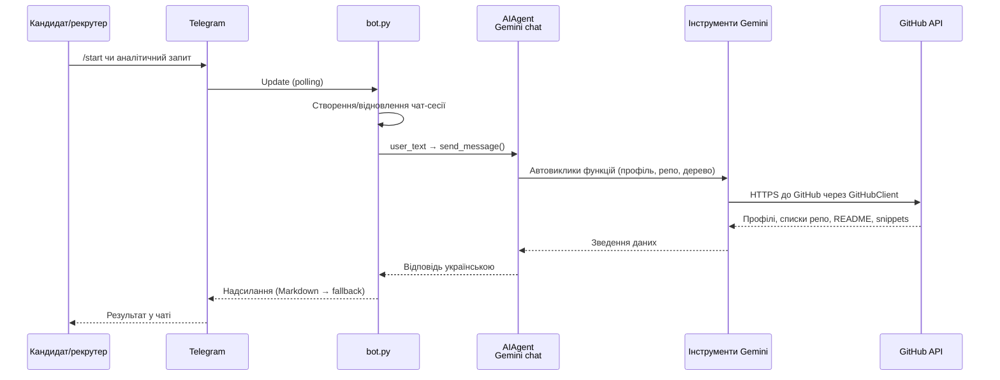

# Архітектура AI Recruiter Bot

## Загальний потік

1. **Користувач у Telegram** звертається до бота (`/start` або довільне повідомлення).
2. **`bot.py`** через бібліотеку `python-telegram-bot` приймає подію, ініціалізує або відновлює чат-сесію `AIAgent` і відправляє запит у Google Gemini.
3. **`AIAgent`** працює з моделлю `gemini-2.0-flash`, яка автоматично викликає зареєстровані функції, коли треба дані з GitHub.
4. Зареєстровані інструменти (`investigate_github_user`, `inspect_github_repository`, тощо) є thin-wrapper'ами навколо **`GitHubClient`**, що використовує PyGithub.
5. **`GitHubClient`** звертається до REST API GitHub, агрегує статистику, дерево файлів або snippets і повертає текстовий опис.
6. **Gemini** комбінує відповідь на основі даних та системних правил (відповідати українською, не розкривати інструменти) і повертає її `bot.py`.
7. **Telegram бот** надсилає користувачу Markdown повідомлення (з fallback на plain text, якщо Markdown не проходить валідацію).

## Діаграма взаємодії

## Відповідність компонентів

- `bot.py`: Telegram обробники `/start` та звичайних повідомлень, черга `asyncio` + `run_in_executor` для блокуючих викликів Gemini.
- `ai_agent.py`: ініціалізація моделі, визначення системних правил та реєстрація функцій, що дозволяють моделі читати GitHub.
- `github_client.py`: робота з PyGithub — нормалізація ідентифікаторів, підбір репозиторіїв, агрегація статистики, отримання дерева та файлів.
- `requirements.txt` / `pyproject.toml`: залежності (`python-telegram-bot`, `google-generativeai`, `PyGithub`, `python-dotenv`).

Ця діаграма описує базовий сценарій: повідомлення користувача → Gemini → GitHub → відповідь. Усі похідні функції (наприклад, фільтрація файлів чи повідомлення про довше очікування) вже входять у цей цикл.
